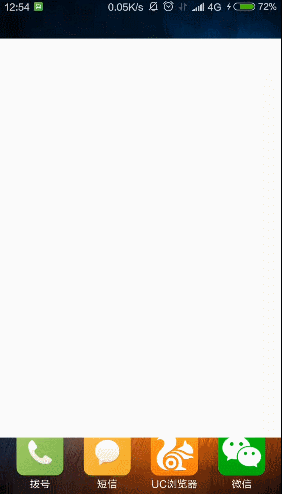

# 干货集中营
## gank.io第三方客户端
gank.io是一个致力于为广大开发者分享最新，最潮和实用干货的一个网站，每日分享妹子图 和 技术干货（涉及Android，iOS，前端等），还有供大家中午休息的休闲视频，同时提供了[免费API](http://gank.io/api)以供开发者学习开发使用.

本项目参考自项目[GankGirl](https://github.com/gaolonglong/GankGirl), 其中应用到了Retrofit+RxJava两个近期在Android开发者中比较流行的框架，UI部分采用Material Design的风格，项目代码量相对较少，自己做了些细节上的小改动(沉浸栏，fab动画等), 欢迎star，fork。^.^

介绍本应用的简书地址：
[Android开源项目学习：GankGirl - Retrofit+RxJava+Material Design](http://www.jianshu.com/p/f358d8ce3185)

图标：


## 效果展示


## 依赖项
```
// 圆形 ImageView
compile 'de.hdodenhof:circleimageview:2.0.0'
compile 'com.android.support:appcompat-v7:23.3.0'
compile 'com.android.support:cardview-v7:23.3.0'
compile 'com.android.support:design:23.3.0'
// View 依赖注入
compile 'com.jakewharton:butterknife:7.0.1'
// 沉浸式状态栏
// http://laobie.github.io/android/2016/03/27/statusbar-util.html
compile 'com.jaeger.statusbaruitl:library:1.0.0'
// RxJava + Retrofit
compile 'io.reactivex:rxjava:1.1.5'
compile 'com.squareup.retrofit2:retrofit:2.0.2'
compile 'com.squareup.retrofit2:converter-gson:2.0.2'
compile 'io.reactivex:rxandroid:1.2.0'
compile 'com.squareup.retrofit2:adapter-rxjava:2.0.2'
// Glide图片加载库
// 使用教程：http://mrfu.me/2016/02/27/Glide_Getting_Started/
compile 'com.github.bumptech.glide:glide:3.7.0'
// EasyRecyclerView
// 使用教程：https://github.com/Jude95/EasyRecyclerView/blob/master/README_ch.md
compile 'com.jude:easyrecyclerview:3.5.7'
compile 'com.github.chrisbanes.photoview:library:1.2.4'
```

#### 参考资料
[给 Android 开发者的 RxJava 详解](http://gank.io/post/560e15be2dca930e00da1083)

[RxJava 与 Retrofit 结合的最佳实践](http://gank.io/post/56e80c2c677659311bed9841)

[Glide - 开始!](http://mrfu.me/2016/02/27/Glide_Getting_Started/)

[Android手机如何录制屏幕及转GIF](http://www.jianshu.com/p/9a1825e679b7)

[利用AS导入GitHub项目](http://anany.me/2015/11/02/git/#more)

[Material Design配色](http://www.materialpalette.com/)

> 图片来源

图标: [Material-Design-Harry](https://dribbble.com/shots/2209211-Material-Design-Harry)

欢迎页:[http://gank.io/post/](http://gank.io/post/)

其它: [Material Design官方icon](https://design.google.com/icons/)
